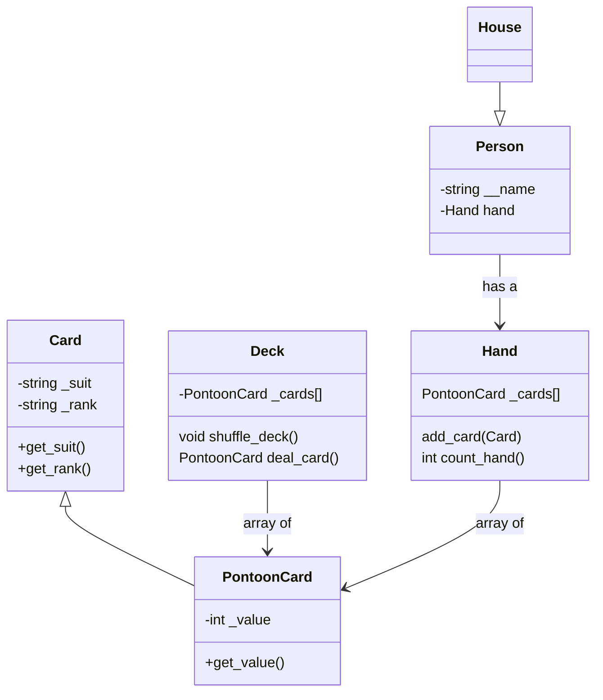

# pontoon
Second Year Python OOP Project 

Enter some text to describe the Python game.

## Design
Classes: 

* Card
* Hand
* Deck
* PontoonCard
* Player
* House
* PontoonGame

```mermaid

classDiagram
    Card <|-- PontoonCard
    Deck --> PontoonCard: array of
    Hand --> PontoonCard: array of
    Person --> Hand: has a
    House --|> Person
    class Card{
        -string _suit
        -string _rank
        +get_suit()
        +get_rank()
    }
    class PontoonCard{
        -int _value

        +get_value()
    }
    class Deck{
    -PontoonCard _cards[]
    void shuffle_deck()
    PontoonCard deal_card()
    }
    class Hand{
        PontoonCard _cards[]
        add_card(Card)
        int count_hand()
    }
    class Person{
        -string __name
        -Hand hand
    }
    class House{
        
    }
    

```