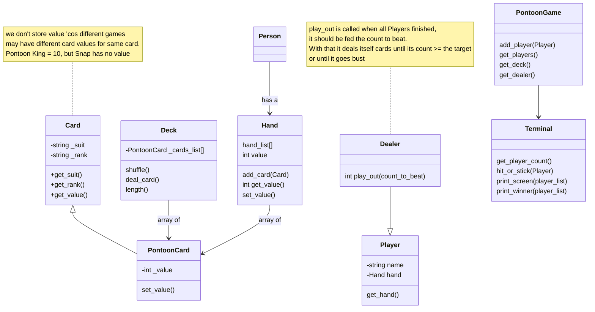

# pontoon
Second Year Python OOP Project 

This is an OOP Python project. The goal is to create the Game Pontoon - otherwise known as 21 or Blackjack.

The Game first asks how many players are playing. With this number, a set of associated Player object instances are created.
A Dealer object, which is a subclass of Player is also create to represent the dealer. It is called into action once all the Players have played.

On launch, the game creates a deck with 52 standard cards, and using the subclass PontoonCard, this assigns a value to each card for the game.

The game will loop through all players individually asking them to hit or stick. If they over 21 they are bust and their could is set to 0 to reflect this.

Finally, the dealer object is requested to play, given the highest active count at the table to beat.

## Design
Classes: 

* Card: Simple Card Class. Expected to be inherited with game specific value
* PontoonCard: subclass of Card. Sets face cards to 10 and Ace to 11
* Hand: Represents a players hand. A collection of Cards and a hand value
* Deck: Collection of cards to begin. Expect to pop cards as dealt and move cards onto Hand array
* Player: Represents a player
* Dealier: Special Player - no interaction, a play_out() will finish out game
* PontoonGame: Need a class for pulling everything together and contorlling the game logic

## Card

   The Card constructor takes in the suit and the rank of the card to create

   A Card has no concept of 'value' as different games may assign different values to a card.
   It is expected a subclass of this type will set the value. Here we set it to 0 to reflect this.
   This allows this class to supply a reusable getter for value

## PontoonCard

PontoonCard is a subclass of Card.

The specialization in this class is related to the value assigned to a card.
Number cards have their numerical value
The Ace card is assigned a value of 11
All other picture cards are assigned a value of 10

## Deck

The Deck Class represents a deck of 52 cards.
The Deck Class supports the ability to randomly shuffle a deck. It also has an operation to deal a card from the deck

## Hand

The Hand Class represent a Player's hand.
The Hand class will contain a number of cards and a value. The value is the cumulative count of all cards held by the hand.
add_card adds a card object to a hand instance

Along with adding a card, the value of the added card is added to the hand value on this call

## Player

The Player class represents a player in a game.

This Class is quite simple in that it has 2 attributes - a name and a hand.
See the Hand Class description for information on that.

## Dealer

THe Dealer class is a subclass of Player.

This class adds specialized functionality specific to a Dealer.
The constructor takes in an instance of a playing deck to allow the Dealer instance to operator on that.

play_out instructs the dealer instance to attempt to beat the count_to_beat integer.

This function is typically called when call the players have had their turn at the game.
count_to_beat represents the current round's highest hand held.
play_out will either succeed in beating this or going bust.
The user of this function will understand a return value greater than 21 implies bust.

## PontoonGame

PontoonGame represents an instance of a game of Pontoon.

The PontoonGame card is reponsible for setting up the game. Thi
This involves:
Creating a deck
Creating a dealer
Adding players
This class also holds a _game_leader reference to a player instance, which is the current game leader based on hand value

## Terminal

The Terminal Class encapsulates all interaction with the game prompt

THe Terminal Class is responsible for:
Getting the number of players wishing to play the game.
Asking a player whether they want to hit or stick
Printing the 'table' info to screen

