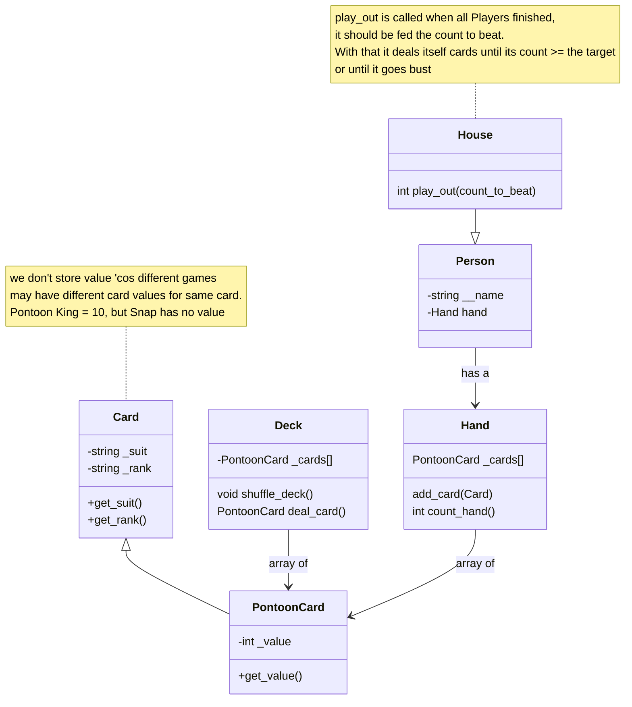

# pontoon
Second Year Python OOP Project 

Enter some text to describe the Pontoon game.

## Design
Classes: 

* Card: Simple Card Class. Expected to be inherited with game specific value
* PontoonCard: subclass of Card. Sets face cards to 10 and Ace to 11
* Hand: Represents a players hand. A collection of Cards and a hand value
* Deck: Collection of cards to begin. Expect to pop cards as dealt and move cards onto Hand array
* Player: Represents a player
* House: Special Player - no interaction, a play() will finish out game
* PontoonGame: Need a class for pulling everything together and contorlling the game logic

